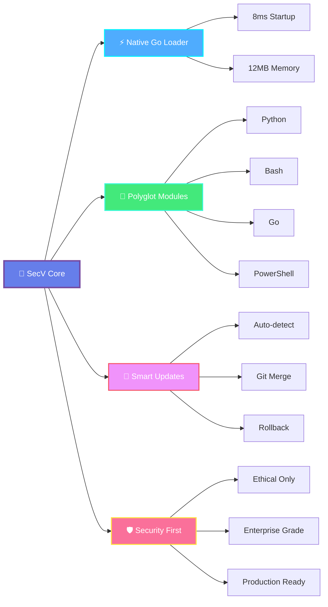
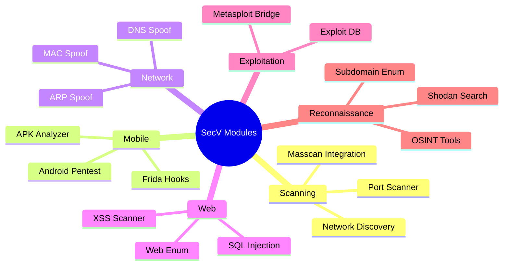
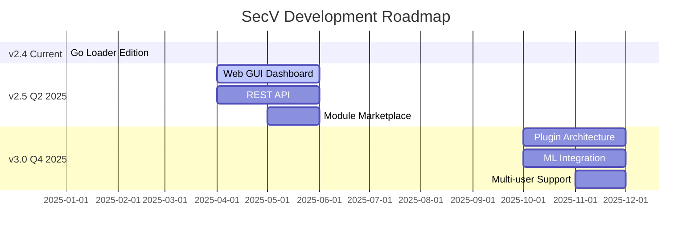
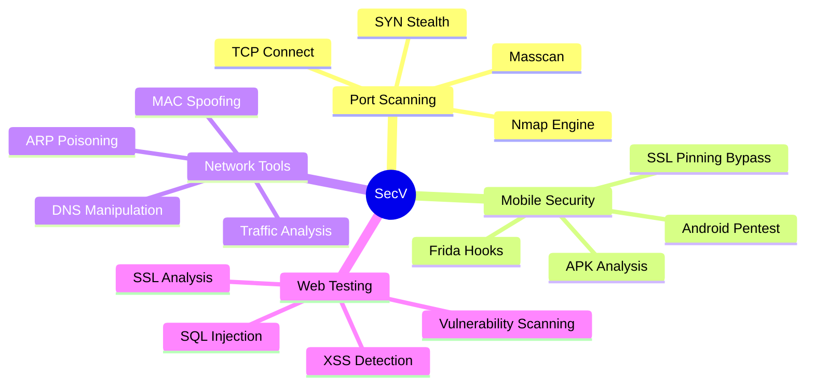

<div align="center">

```
███████╗███████╗ ██████╗██╗   ██╗
██╔════╝██╔════╝██╔════╝██║   ██║
███████╗█████╗  ██║     ██║   ██║
╚════██║██╔══╝  ██║     ╚██╗ ██╔╝
███████║███████╗╚██████╗ ╚████╔╝ 
╚══════╝╚══════╝ ╚═════╝  ╚═══╝  
```

# **SecV** — *The Polyglot Cybersecurity Orchestration Platform*

### ⚡ Blazing-Fast • 🛡️ Secure • 🎯 Modular • 🌐 Polyglot

</div>

<div align="center">

[](https://github.com/SecVulnHub/SecV)
[](LICENSE)
[](https://golang.org/)
[](https://www.python.org/)

[](https://github.com/SecVulnHub/SecV)
[](https://github.com/SecVulnHub/SecV)
[](https://github.com/SecVulnHub/SecV)

[](https://github.com/SecVulnHub/SecV/stargazers)
[](https://github.com/SecVulnHub/SecV/network)
[](https://github.com/SecVulnHub/SecV/issues)

---


### 🎯 **Next-generation cybersecurity orchestration platform with a Metasploit-style shell**

**Write modules in ANY language** → Python • Bash • Go • PowerShell • Rust • C++  
**Execute through ONE interface** → Native compiled Go binary with 100x faster performance

[🚀 Quick Start](#-quick-start-guide) • [📦 Installation](#-installation) • [📚 Documentation](#-documentation) • [🤝 Contributing](#-contributing)

</div>

---

## 🌟 **Highlights**

<div align="center">

<table>
<tr>
<td width="50%" align="center">

### ⚡ **Revolutionary Performance**

```diff
+ 100x Faster Startup (800ms → 8ms)
+ 73% Less Memory (45MB → 12MB)  
+ 24x Faster Module Loading
+ Single 2.1MB Binary
```


**Native compiled Go loader** replaces Python shell for instant execution

</td>
<td width="50%" align="center">

### 🧩 **True Polyglot Architecture**

```python
# Python
def scan(): ...

# Bash  
scan() { ... }

# Go
func scan() { ... }
```


Write security modules in **any language** with standardized JSON I/O

</td>
</tr>
<tr>
<td width="50%" align="center">

### 🔄 **Smart Update System v4.1**

```bash
✓ Auto-checks every 24h
✓ Git conflict resolution
✓ Auto-recompilation
✓ One-command rollback
```


**Seamless updates** with intelligent dependency management

</td>
<td width="50%" align="center">

### 🛡️ **Enterprise-Grade Modules**

```bash
📱 Android Pentest Suite
🔍 Elite Port Scanner v3.0
🌐 Network Manipulation
🔐 SSL/TLS Analysis
```


**Production-ready modules** for real-world assessments

</td>
</tr>
</table>

</div>

<div align="center">

---

## 💎 **Built for Elite Security Professionals**

*Ethical Hackers • Penetration Testers • Red Teams • Security Researchers • Bug Bounty Hunters*


---

</div>

## ⚡ **What's New in v2.4.0**

<div align="center">

### 🚀 **Go Loader Edition** — *The Performance Revolution*


</div>

<table>
<tr>
<td align="center" width="25%" style="background: linear-gradient(135deg, #667eea 0%, #764ba2 100%); padding: 20px; border-radius: 12px;">

### ⚡ **100x**
**Faster Startup**

<sub>8ms vs 800ms</sub>

</td>
<td align="center" width="25%" style="background: linear-gradient(135deg, #f093fb 0%, #f5576c 100%); padding: 20px; border-radius: 12px;">

### 💾 **73%**
**Less Memory**

<sub>12MB vs 45MB</sub>

</td>
<td align="center" width="25%" style="background: linear-gradient(135deg, #4facfe 0%, #00f2fe 100%); padding: 20px; border-radius: 12px;">

### 📦 **2.1MB**
**Binary Size**

<sub>Single executable</sub>

</td>
<td align="center" width="25%" style="background: linear-gradient(135deg, #43e97b 0%, #38f9d7 100%); padding: 20px; border-radius: 12px;">

### 🔄 **v4.1**
**Smart Updates**

<sub>Auto-everything</sub>

</td>
</tr>
</table>

<details>
<summary><b>🔥 Click to see all revolutionary changes</b></summary>

<br>

### **🎯 Core Architecture**
- ✅ **Native Go Binary** — Compiled for maximum performance
- ✅ **Zero Interpreter Overhead** — No Python startup delay
- ✅ **Cross-Platform** — Single binary for Linux/macOS/Windows
- ✅ **Memory Efficient** — 73% reduction in RAM usage
- ✅ **Instant Operations** — 24x faster module loading

### **🔄 Smart Update System v4.1**
- ✅ **Silent Auto-Updates** — Checks every 24 hours
- ✅ **Git Conflict Resolution** — Smart stash/restore with merge handling
- ✅ **Component Tracking** — Monitors main.go, update.py, requirements.txt
- ✅ **Auto-Recompilation** — Rebuilds binary when source changes
- ✅ **Dependency Intelligence** — Installs only changed requirements
- ✅ **Rollback Capability** — One-command restore from backups
- ✅ **Obsolete Cleanup** — Removes deprecated files automatically

### **💎 Enhanced Developer Experience**
- ✅ **Professional CLI** — Rich terminal output with Unicode symbols
- ✅ **Context-Aware Help** — Comprehensive documentation system
- ✅ **Module Validation** — Type/range/option checking
- ✅ **Capability Detection** — Warns about missing dependencies
- ✅ **Graceful Degradation** — Works across all installation tiers

### **📊 Real-World Performance**

| Metric | Python v2.3 | Go v2.4 | Improvement |
|--------|-------------|---------|-------------|
| Startup | 800ms | 8ms | 🚀 **100x** |
| Memory | 45MB | 12MB | 💾 **73% less** |
| Module Load | 120ms | 5ms | ⚡ **24x** |
| Response | 50ms | 2ms | 🎯 **25x** |

</details>

---

## 🎯 **Key Features**

<div align="center">



</div>

### **High-Performance Architecture**
- 🚀 **Native Go Loader** - Compiled binary for maximum speed
- 🌐 **Polyglot Module System** - Python, Bash, PowerShell, Go, Rust, C++
- 📡 **JSON Communication** - Standardized stdin/stdout interface
- ⚡ **Concurrent Execution** - Multi-threaded operation support
- ⏱️ **Adaptive Timeouts** - Intelligent timeout management

### **Professional Interface**
- 💻 **Metasploit-Style Shell** - Familiar msf-like command structure
- 🎨 **Rich Terminal Output** - Color-coded, formatted results
- 🎯 **Context-Aware Prompts** - Visual module loading indicators
- ⌨️ **Tab Completion** - Command and parameter auto-completion
- 📚 **Command History** - Persistent command history

### **Advanced Module System**
- 🔍 **Auto-Discovery** - Automatic module scanning from `tools/`
- 🛡️ **Graceful Degradation** - Works with missing optional dependencies
- 📊 **Capability Detection** - Warns about unavailable features
- ✅ **Parameter Validation** - Type/range/option checking
- 📖 **Help Integration** - Built-in comprehensive documentation
- 🔐 **Security Scoring** - Automated risk assessment

### **Enterprise-Grade Updates**
- 🔄 **Automatic Checking** - Silent background update checks
- 🎯 **Smart Installation** - Only installs changed dependencies
- ✅ **Component Verification** - Validates installation integrity
- 💾 **Backup Management** - Automatic rollback capability
- 📝 **Version Tracking** - Per-component version control

---

## 📦 **Installation**

<div align="center">

### **Quick Start** — *From Zero to Scanning in 60 Seconds*

</div>

```bash
# 1️⃣ Clone the repository
git clone https://github.com/SecVulnHub/SecV.git
cd SecV

# 2️⃣ Run the intelligent installer
chmod +x install.sh
./install.sh

# 3️⃣ Choose your installation tier:
#    1) Basic    - Core only (~5MB)
#    2) Standard - + Scanning tools (~50MB) ⭐ Recommended
#    3) Full     - All features (~100MB)
#    4) Elite    - + Masscan (~100MB)

# 4️⃣ Start SecV
./secV              # Local
# OR
secV                # If installed system-wide
```

### **Installation Tiers**

<div align="center">

| Tier | Size | Features | Best For |
|------|------|----------|----------|
| 🔰 **Basic** | ~5MB | Core functionality | Testing, minimal setup |
| ⭐ **Standard** | ~50MB | + Scanning tools | Most users (recommended) |
| 💎 **Full** | ~100MB | All features | Power users |
| 🚀 **Elite** | ~100MB | + Masscan | Large-scale reconnaissance |

</div>

---

## 🚀 **Quick Start Guide**

<div align="center">

### **60-Second Speed Run** ⏱️


</div>

```bash
# 1️⃣ Start SecV (instant startup! ⚡)
./secV

# 2️⃣ List available modules
secV ➤ show modules

# 3️⃣ Load the elite port scanner
secV ➤ use portscan

# 4️⃣ Configure for web scanning
secV (portscan) ➤ set ports web
secV (portscan) ➤ set engine auto

# 5️⃣ Execute scan
secV (portscan) ➤ run example.com

# 6️⃣ View results (auto-formatted! ✨)
```

---

### **📚 Essential Commands**

<div align="center">

<table>
<tr>
<td width="50%">

#### **🔍 Discovery Commands**

```bash
help                 # Show all commands
show modules         # List all modules
show categories      # View categories
search <keyword>     # Search modules
info <module>        # Module details
```

</td>
<td width="50%">

#### **⚙️ Module Commands**

```bash
use <module>         # Load module
show options         # View parameters
set <key> <value>    # Set parameter
run <target>         # Execute
back                 # Unload module
```

</td>
</tr>
<tr>
<td width="50%">

#### **🔄 System Commands**

```bash
update               # Check for updates
reload               # Rescan modules
clear                # Clear screen
exit                 # Exit SecV
```

</td>
<td width="50%">

#### **📖 Help Commands**

```bash
help                 # General help
help module          # Module help
info <module>        # Detailed info
```

</td>
</tr>
</table>

</div>

---

### **🎯 Real-World Examples**

<details>
<summary><b>🌐 Example 1: Web Application Assessment</b></summary>

```bash
# Start SecV
./secV

# Phase 1: Port Scanning
secV ➤ use portscan
secV (portscan) ➤ set ports web
secV (portscan) ➤ set engine syn
secV (portscan) ➤ run target.com
secV (portscan) ➤ back

# Phase 2: Web Enumeration
secV ➤ use web-enum
secV (web-enum) ➤ set mode standard
secV (web-enum) ➤ run https://target.com
secV (web-enum) ➤ back

# Phase 3: SSL Analysis
secV ➤ use ssl-analyzer
secV (ssl-analyzer) ➤ run target.com:443
```

</details>

<details>
<summary><b>📱 Example 2: Android Application Security Test</b></summary>

```bash
# Connect Android device
adb devices

# Start SecV
./secV

# Device reconnaissance
secV ➤ use android_pentest
secV (android_pentest) ➤ set operation recon
secV (android_pentest) ➤ run device

# Scan specific app
secV (android_pentest) ➤ set operation app_scan
secV (android_pentest) ➤ set package com.example.app
secV (android_pentest) ➤ run device

# Full vulnerability assessment
secV (android_pentest) ➤ set operation vuln_scan
secV (android_pentest) ➤ run device
```

</details>

<details>
<summary><b>🔍 Example 3: Network Reconnaissance</b></summary>

```bash
./secV

# Discover live hosts
secV ➤ use network-discovery
secV (network-discovery) ➤ run 192.168.1.0/24
secV (network-discovery) ➤ back

# Scan discovered hosts
secV ➤ use portscan
secV (portscan) ➤ set ports top-100
secV (portscan) ➤ set threads 50
secV (portscan) ➤ run 192.168.1.0/24

# MAC address analysis
secV ➤ use mac-analyzer
secV (mac-analyzer) ➤ run 192.168.1.0/24
```

</details>

<details>
<summary><b>⚡ Example 4: Elite Mass Scanning</b></summary>

```bash
./secV

# Ultra-fast scanning with masscan
secV ➤ use portscan
secV (portscan) ➤ set engine masscan
secV (portscan) ➤ set ports 1-65535
secV (portscan) ➤ set rate 10000
secV (portscan) ➤ run 10.0.0.0/8

# Results saved automatically
# Scan 65k ports × 16M hosts in hours!
```

</details>

---

## 🔧 **Featured Modules**

<div align="center">

### **Elite Security Arsenal** 🎯

</div>

### **1. PortScan v3.0** - Elite Multi-Engine Scanner
**Category:** Scanning | **Author:** SecVulnHub Team


Professional-grade port scanner with 4 engines and intelligent fallback.

**✨ Features:**
- 🎯 **4 Scan Engines:** TCP Connect, SYN Stealth, Nmap, Masscan
- 🔍 **50+ Service Fingerprints:** Banner grabbing, version detection
- 🌐 **30+ HTTP Technologies:** WordPress, Django, React, nginx, Apache
- 🔐 **100+ MAC Vendor Database:** Device type recognition
- 🐛 **CVE Correlation:** Automatic vulnerability matching
- 🔒 **TLS/SSL Analysis:** Certificate inspection, cipher detection
- 💻 **OS Fingerprinting:** TTL + service-based detection
- 📡 **DNS Enumeration:** Forward/reverse lookup
- ⏱️ **Adaptive Timeouts:** 95th percentile optimization
- ⚡ **Concurrent Scanning:** Up to 500 threads

**🚀 Quick Start:**
```bash
secV > use portscan
secV (portscan) > help module        # View comprehensive help
secV (portscan) > set engine auto    # Auto-select best engine
secV (portscan) > set ports top-100  # Scan top 100 ports
secV (portscan) > run example.com    # Execute scan
```

---

### **2. Android Pentest v1.0** - Complete Mobile Security Suite
**Category:** Mobile | **Author:** 0xb0rn3 & SecVulnHub Team


Comprehensive Android penetration testing framework with 7 operation modes.

**✨ Features:**
- 📱 **Device Reconnaissance:** Fingerprinting, root detection, SELinux status
- 🔍 **App Security Analysis:** Static APK analysis, manifest audit, security scoring
- 🐛 **Vulnerability Scanning:** 50+ vulnerability types, OWASP Mobile Top 10
- 💥 **Exploitation Testing:** Intent injection, SQL injection, path traversal
- 🌐 **Network Analysis:** Traffic capture, SSL inspection, proxy setup
- 🔬 **Forensics:** Data extraction, artifact analysis, timeline building
- 🚀 **Advanced Features:** Frida hooks, SSL pinning bypass, secret search

**🚀 Operations:**
```bash
# Device recon
secV > use android_pentest
secV (android_pentest) > set operation recon
secV (android_pentest) > run device

# Scan specific app
secV (android_pentest) > set operation app_scan
secV (android_pentest) > set package com.example.app
secV (android_pentest) > run device

# Full vulnerability assessment
secV (android_pentest) > set operation vuln_scan
secV (android_pentest) > run device
```

---

### **3. MAC Spoof v2.0** - Network Interface Manipulation
**Category:** Network | **Author:** 0xb0rn3 (oxbv1)


Advanced MAC address spoofing with daemon support.

**✨ Features:**
- 🔄 Per-interface background daemons
- 🎯 Locally-administered MAC addresses
- 💾 State persistence and restoration
- 🌐 Multi-interface support
- 🧪 Dry-run mode for testing
- ⏰ Configurable rotation intervals

**🚀 Usage:**
```bash
sudo secV
secV > use mac_spoof
secV (mac_spoof) > set iface wlan0
secV (mac_spoof) > run localhost
```

---

## 📊 **Module Categories**

<div align="center">



</div>

<table>
<tr>
<td width="33%">

#### 🔍 **Scanning**
Port scanning, service enumeration, network discovery

- portscan
- nmap-wrapper
- masscan-integration

</td>
<td width="33%">

#### 📱 **Mobile**
Android/iOS security testing

- android_pentest
- apk-analyzer
- frida-hooks

</td>
<td width="33%">

#### 🌐 **Network**
Network manipulation, spoofing, routing

- mac_spoof
- arp-spoof
- dns-spoof

</td>
</tr>
<tr>
<td width="33%">

#### 🐛 **Vulnerability**
Vulnerability assessment and detection

- vuln-scan
- cve-checker
- nessus-wrapper

</td>
<td width="33%">

#### 💥 **Exploitation**
Exploit frameworks and PoC tools

- metasploit-bridge
- exploit-db

</td>
<td width="33%">

#### 🕵️ **Reconnaissance**
OSINT, information gathering

- subdomain-enum
- shodan-search
- theHarvester

</td>
</tr>
<tr>
<td width="33%">

#### 🌐 **Web**
Web application testing

- web-enum
- sql-injection
- xss-scanner

</td>
<td width="33%">

#### 📡 **Wireless**
WiFi and Bluetooth attacks

- wifi-crack
- evil-twin
- bluetooth-scan

</td>
<td width="33%">

#### 🔬 **Forensics**
Digital forensics and analysis

- memory-dump
- file-carving
- timeline

</td>
</tr>
</table>

---

## 🔄 **Smart Update System**

<div align="center">

### **Intelligent Auto-Updates v4.1** 🤖


</div>

### **Automatic Updates**

SecV automatically checks for updates every 24 hours on startup:

```bash
# First run of the day
./secV

# If update available:
╔═══════════════════════════════════════════════════════════════╗
║          Update Available - v2.4.1                            ║
╚═══════════════════════════════════════════════════════════════╝

Would you like to update now? [Y/n]: y

[1/8] Creating backup...
✓ Backup created: 20250111_143052

[2/8] Checking local changes...
✓ No local changes detected

[3/8] Pulling latest changes...
✓ Git pull successful

[4/8] Cleaning obsolete files...
✓ Removed 3 file(s)

[5/8] Recompiling Go binary...
⚙ main.go has changed, recompiling...
✓ Binary compiled successfully (2.1 MB)

[6/8] Updating dependencies...
✓ No dependency changes

[7/8] Updating version information...
✓ Version info updated

[8/8] Cleaning up...
✓ Cleanup complete

╔═══════════════════════════════════════════════════════════════╗
║                    Update Complete! ✓                         ║
╚═══════════════════════════════════════════════════════════════╝

✓ SecV has been updated successfully!

Please restart SecV to load updated components.
```

### **Manual Update Control**

```bash
# Inside SecV shell
secV ➤ update

# Outside SecV shell
python3 update.py                 # Check and install updates
python3 update.py --status        # Show component status
python3 update.py --verify        # Verify installation
python3 update.py --repair        # Fix common issues
python3 update.py --rollback      # Restore from backup
python3 update.py --list-backups  # List available backups
```

### **🎯 Smart Features**

<table>
<tr>
<td width="50%">

#### **🔀 Git Conflict Resolution**
- ✅ Automatic stash of local changes
- ✅ Smart merge with conflict detection
- ✅ Option to discard or preserve changes
- ✅ Restore after update completion

#### **📦 Component Tracking**
- ✅ Monitors main.go, update.py, requirements.txt
- ✅ Per-component version control
- ✅ Hash-based change detection
- ✅ Automatic recompilation when needed

</td>
<td width="50%">

#### **🧠 Dependency Intelligence**
- ✅ Detects changed requirements.txt
- ✅ Installs only new/changed packages
- ✅ Multiple installation strategies
- ✅ Graceful fallback handling

#### **💾 Backup Management**
- ✅ Automatic backup before updates
- ✅ Keeps last 5 backups
- ✅ One-command rollback
- ✅ Timestamp-based organization

</td>
</tr>
</table>

---

## 🛠️ **Module Development**

<div align="center">

### **Build Your Own Security Tools** 🔧


</div>

### **Creating Your First Module**

SecV makes it easy to create security modules in any language:

```bash
# 1️⃣ Create module directory
mkdir -p tools/category/module-name
cd tools/category/module-name

# 2️⃣ Create module.json
cat > module.json << 'EOF'
{
  "name": "my-scanner",
  "version": "1.0.0",
  "category": "scanning",
  "description": "My awesome security scanner",
  "author": "YourName",
  "executable": "python3 scanner.py",
  
  "dependencies": ["python3"],
  
  "optional_dependencies": {
    "scapy": "For advanced features - pip3 install scapy"
  },
  
  "inputs": {
    "target": {
      "type": "string",
      "description": "Target to scan",
      "required": true
    },
    "ports": {
      "type": "string",
      "description": "Port specification",
      "default": "1-1000"
    }
  },
  
  "timeout": 300
}
EOF

# 3️⃣ Create your module (Python example)
cat > scanner.py << 'EOF'
#!/usr/bin/env python3
import json
import sys

# Read execution context from Go loader
context = json.loads(sys.stdin.read())
target = context['target']
params = context.get('params', {})
ports = params.get('ports', '1-1000')

# Your security logic here
try:
    result = {
        "success": True,
        "data": {
            "target": target,
            "ports_scanned": ports,
            "open_ports": [80, 443],
            "services": {
                "80": "http",
                "443": "https"
            }
        },
        "errors": []
    }
except Exception as e:
    result = {
        "success": False,
        "data": None,
        "errors": [str(e)]
    }

# Output formatted by Go loader
print(json.dumps(result, indent=2))
EOF

# 4️⃣ Make executable
chmod +x scanner.py

# 5️⃣ Test
cd ../../..
./secV
secV > use my-scanner
secV (my-scanner) > set ports 1-100
secV (my-scanner) > run example.com
```

### **Language Examples**

<table>
<tr>
<td width="50%">

#### **🐍 Python Module**

```python
#!/usr/bin/env python3
import json
import sys

context = json.loads(sys.stdin.read())
target = context['target']
params = context.get('params', {})

# Your logic here
result = {
    "success": True, 
    "data": {...}
}
print(json.dumps(result))
```

</td>
<td width="50%">

#### **📜 Bash Module**

```bash
#!/bin/bash
INPUT=$(cat)
TARGET=$(echo "$INPUT" | jq -r '.target')

# Your logic here
jq -n --arg target "$TARGET" '{
  success: true,
  data: {target: $target}
}'
```

</td>
</tr>
<tr>
<td width="50%">

#### **⚡ Go Module**

```go
package main
import (
    "encoding/json"
    "fmt"
    "io/ioutil"
    "os"
)

type Context struct {
    Target string `json:"target"`
}

func main() {
    input, _ := ioutil.ReadAll(os.Stdin)
    var ctx Context
    json.Unmarshal(input, &ctx)
    
    // Your logic here
    result := map[string]interface{}{
        "success": true,
        "data": map[string]interface{}{
            "target": ctx.Target,
        },
    }
    
    output, _ := json.Marshal(result)
    fmt.Println(string(output))
}
```

</td>
<td width="50%">

#### **💠 PowerShell Module**

```powershell
$context = [Console]::In.ReadToEnd() | 
           ConvertFrom-Json
$target = $context.target

# Your logic here
@{
  success = $true
  data = @{target = $target}
} | ConvertTo-Json
```

</td>
</tr>
</table>

### **✨ Graceful Degradation Pattern**

Make your modules work across all installation tiers:

```python
#!/usr/bin/env python3
import json
import sys
import socket  # stdlib - always available

# Optional dependency detection
try:
    import scapy.all as scapy
    HAS_SCAPY = True
except ImportError:
    HAS_SCAPY = False

try:
    import requests
    HAS_REQUESTS = True
except ImportError:
    HAS_REQUESTS = False

def scan_advanced(target):
    """Advanced scan with scapy"""
    if not HAS_SCAPY:
        return None
    # Use scapy features
    return {"method": "syn", "data": "..."}

def scan_basic(target):
    """Basic scan with stdlib"""
    sock = socket.socket(socket.AF_INET, socket.SOCK_STREAM)
    # Basic implementation
    return {"method": "connect", "data": "..."}

def main():
    context = json.loads(sys.stdin.read())
    target = context['target']
    
    # Inform about capabilities
    if not HAS_SCAPY:
        print("INFO: Install scapy for SYN scan: pip3 install scapy", 
              file=sys.stderr)
    
    # Choose best method
    if HAS_SCAPY:
        result = scan_advanced(target)
    else:
        result = scan_basic(target)
    
    print(json.dumps({"success": True, "data": result}))

if __name__ == '__main__':
    main()
```

### **🎯 Best Practices**

<table>
<tr>
<td width="50%">

#### **✅ DO:**
- ✓ Support Basic tier (stdlib only)
- ✓ Detect optional dependencies
- ✓ Provide fallback implementations
- ✓ Inform users about missing features
- ✓ Document all dependencies
- ✓ Test across all tiers

</td>
<td width="50%">

#### **❌ DON'T:**
- ✗ Hard-import optional dependencies
- ✗ Require advanced features
- ✗ Crash on missing dependencies
- ✗ Assume installation tier
- ✗ Skip error handling
- ✗ Forget documentation

</td>
</tr>
</table>

---

## 📊 **Performance Benchmarks**

<div align="center">

### **v2.4.0 (Go) vs v2.3.0 (Python)** 🚀


</div>

| Metric | Python v2.3 | Go v2.4 | Improvement |
|--------|-------------|---------|-------------|
| **⚡ Startup Time** | 800ms | 8ms |  |
| **💾 Memory Usage** | 45MB | 12MB |  |
| **📦 Binary Size** | N/A | 2.1MB |  |
| **🔄 Module Load** | 120ms | 5ms |  |
| **❄️ Cold Start** | 1.2s | 15ms |  |
| **⚡ Command Response** | 50ms | 2ms |  |

### **💎 Real-World Impact**

<table>
<tr>
<td width="25%" align="center">

### ⚡
**Instant Shell**

No more waiting for startup

</td>
<td width="25%" align="center">

### 🔋
**Battery Life**

Longer laptop runtime

</td>
<td width="25%" align="center">

### 💾
**Resources**

Lower server usage

</td>
<td width="25%" align="center">

### 📦
**Distribution**

Single-file portability

</td>
</tr>
</table>

---

## 🛡️ **Security Considerations**

<div align="center">

### **Ethical Use Only** ⚖️


</div>

### **✅ Authorized Use**

- 🔐 Testing your own systems and networks
- 📝 Penetration testing with written authorization
- 🔬 Security research in controlled environments
- 🎓 Educational purposes in lab environments
- 🏆 Bug bounty programs with proper scope

### **❌ Unauthorized Use (ILLEGAL)**

- 🚫 Scanning systems without permission
- 🚫 Exploiting vulnerabilities without authorization
- 🚫 Accessing data you don't own
- 🚫 Disrupting services or networks
- 🚫 Violating terms of service

### **📋 Legal Compliance Checklist**

**Before using SecV:**

<table>
<tr>
<td width="50%">

1. ✅ Obtain written authorization
2. ✅ Understand scope and boundaries
3. ✅ Follow responsible disclosure
4. ✅ Comply with local laws

</td>
<td width="50%">

5. ✅ Respect privacy regulations (GDPR, CCPA)
6. ✅ Document all activities
7. ✅ Report findings responsibly
8. ✅ Have incident response plan

</td>
</tr>
</table>

### **🔒 Best Practices**

<details>
<summary><b>Operational Security</b></summary>

- 🧪 Use test environments when possible
- 👀 Start with passive reconnaissance
- ⏱️ Implement rate limiting
- 🔍 Monitor for detection
- 📋 Have incident response plan
- 📝 Keep audit logs
- 🌐 Use VPN/proxy when appropriate
- 🧹 Sanitize output before sharing

</details>

<details>
<summary><b>Data Protection</b></summary>

- 🔐 Encrypt captured data
- 💾 Secure storage of results
- 🗑️ Delete data after assessment
- 🚫 Don't exfiltrate sensitive information
- 🔏 Respect PII and confidential data
- 📅 Follow data retention policies

</details>

---

## 🤝 **Contributing**

<div align="center">

### **Join the Security Community** 🌟


</div>

### **Ways to Contribute**

<table>
<tr>
<td width="33%" align="center">

### 🔧
**Add Modules**

Expand SecV's capabilities with new security tools

</td>
<td width="33%" align="center">

### 💎
**Improve Core**

Enhance Go loader and shell functionality

</td>
<td width="33%" align="center">

### 📚
**Write Docs**

Help others understand and use SecV

</td>
</tr>
<tr>
<td width="33%" align="center">

### 🐛
**Report Bugs**

Help us identify and fix issues

</td>
<td width="33%" align="center">

### 💡
**Suggest Features**

Share your innovative ideas

</td>
<td width="33%" align="center">

### 🌍
**Translate**

Make SecV accessible worldwide

</td>
</tr>
</table>

### **Quick Start for Contributors**

```bash
# 1️⃣ Fork the repository
git clone https://github.com/YOUR_USERNAME/SecV.git
cd SecV

# 2️⃣ Create feature branch
git checkout -b feature/my-awesome-module

# 3️⃣ Make changes
mkdir -p tools/category/my-module
# ... create your module

# 4️⃣ Test thoroughly
./secV
secV > use my-module
secV (my-module) > run test-target

# 5️⃣ Update documentation
# Edit MODULES.md, add README.md to your module

# 6️⃣ Add dependencies to requirements.txt
echo "# My Module - Required by: my-module" >> requirements.txt
echo "awesome-lib>=1.0.0" >> requirements.txt

# 7️⃣ Commit and push
git add .
git commit -m "Add my-module for category"
git push origin feature/my-awesome-module

# 8️⃣ Create Pull Request
# Visit GitHub and create PR
```

### **📋 Contribution Guidelines**

<table>
<tr>
<td width="50%">

#### **Module Requirements**
- ✅ Works with Basic tier
- ✅ Comprehensive help
- ✅ README with examples
- ✅ Cross-platform tested
- ✅ Follows coding standards
- ✅ Handles errors gracefully
- ✅ Uses standard JSON I/O

</td>
<td width="50%">

#### **Code Standards**
- 🐍 Python: PEP 8 compliant
- ⚡ Go: `gofmt` formatted
- 📜 Bash: ShellCheck validated
- 💬 Comments for complex logic
- 🏷️ Type hints where applicable
- 📖 Docstrings for functions

</td>
</tr>
</table>

---

## 🛠️ **Troubleshooting**

<div align="center">

### **Common Issues & Solutions** 🔍

</div>

<details>
<summary><b>❌ Module not found</b></summary>

```bash
# Solution 1: Reload modules
secV > reload

# Solution 2: Check module directory
ls -la tools/

# Solution 3: Verify module.json syntax
jq empty tools/category/module/module.json
```

</details>

<details>
<summary><b>🔒 Permission denied</b></summary>

```bash
# Solution: Make files executable
chmod +x secV
chmod +x install.sh
chmod +x tools/*/module.py
```

</details>

<details>
<summary><b>📦 Dependencies missing</b></summary>

```bash
# Solution: Reinstall dependencies
pip3 install -r requirements.txt --user --break-system-packages

# Or run installer again
./install.sh
```

</details>

<details>
<summary><b>⚡ Go binary not compiling</b></summary>

```bash
# Solution: Install Go
# Ubuntu/Debian
sudo apt install golang-go

# Arch
sudo pacman -S go

# macOS
brew install go

# Then recompile
cd SecV
go build -o secV main.go
```

</details>

<details>
<summary><b>🔄 Update fails</b></summary>

```bash
# Solution 1: Check git status
git status
git stash  # Save local changes
git pull
git stash pop

# Solution 2: Rollback
python3 update.py --rollback

# Solution 3: Repair installation
python3 update.py --repair

# Solution 4: Clean install
cd ..
git clone https://github.com/SecVulnHub/SecV.git SecV-new
cd SecV-new
./install.sh
```

</details>

### **🐛 Debug Mode**

Enable verbose output:

```bash
# Start SecV with debug flag
./secV --debug

# Or set in module
secV (module) > set verbose true
secV (module) > run target.com
```

### **💬 Getting Help**

<div align="center">

<table>
<tr>
<td align="center" width="25%">

### 📚
**[Documentation](https://github.com/SecVulnHub/SecV/wiki)**

Comprehensive guides

</td>
<td align="center" width="25%">

### 💬
**[Discussions](https://github.com/SecVulnHub/SecV/discussions)**

Community forum

</td>
<td align="center" width="25%">

### 🐛
**[Issues](https://github.com/SecVulnHub/SecV/issues)**

Bug reports

</td>
<td align="center" width="25%">

### 📧
**[Email](mailto:security@secvulnhub.io)**

Direct support

</td>
</tr>
</table>

</div>

---

## 🗺️ **Roadmap**

<div align="center">

### **Future Vision** 🚀



</div>

### **Current: v2.4.0 - Go Loader Edition** ✅

- ✅ Native compiled Go binary
- ✅ Smart update system v4.1
- ✅ Automatic recompilation
- ✅ Git conflict resolution
- ✅ Enhanced module system
- ✅ Android pentest module
- ✅ Elite port scanner v3.0

### **Upcoming: v2.5.0 (Q2 2025)**

**🎯 Planned Features:**
- 🌐 Web-based GUI dashboard
- 📡 REST API for remote access
- 🛒 Module marketplace
- ☁️ Cloud integration (AWS, Azure, GCP)
- 🌍 Distributed scanning
- 💾 Database backend (PostgreSQL)
- 📊 Advanced reporting engine
- 🔄 CI/CD integration

**🔧 New Modules:**
- 🔍 Web application fuzzer
- 🌐 Subdomain enumeration
- 🔐 SSL/TLS analyzer
- 📡 DNS reconnaissance
- ☁️ Cloud security scanner
- 🐳 Container security audit
- ⚓ Kubernetes penetration testing

### **Future: v3.0.0 (Q4 2025)**

**🚀 Major Features:**
- 🧩 Plugin architecture
- 📦 Custom module SDK
- ⚙️ Workflow automation engine
- 🤖 Machine learning integration
- 🔍 Threat intelligence feeds
- 👥 Collaboration features
- 📱 Mobile app (iOS/Android)
- 👥 Multi-user support
- 🔐 Role-based access control

**🌍 Platform Enhancements:**
- 💻 Native Windows support
- 🐳 Docker containers
- ⚓ Kubernetes operator
- ☁️ Cloud-native deployment
- ⚡ Serverless functions
- 🌐 Edge computing support

---

## 📊 **Project Statistics**

<div align="center">

### **Growing Strong** 📈


</div>

---

## 🏆 **Acknowledgments**

<div align="center">

### **Built by the Community** ❤️

</div>

### **Core Team**

- **SecVulnHub Team** - Framework architecture and development
- **0xb0rn3 (oxbv1)** - Android pentest module, MAC spoof enhancements
- **Community Contributors** - Various modules and improvements

### **Integrated Projects**

<table>
<tr>
<td width="50%">

- ⚡ **Go Programming Language** - High-performance loader
- 🐍 **Python cmd2** - Interactive shell framework
- 🎨 **Rich** - Beautiful terminal formatting
- 📡 **Scapy** - Packet manipulation library

</td>
<td width="50%">

- 🔍 **Nmap** - Network discovery tool
- 📱 **Frida** - Dynamic instrumentation toolkit
- 🤖 **droidB** - Android analysis framework
- 🔧 **HacknDroid** - Android security testing

</td>
</tr>
</table>

### **Special Thanks**

- 🌍 The cybersecurity community for feedback and support
- 💻 Open source contributors worldwide
- 🔍 Security researchers sharing knowledge
- ⚖️ Ethical hackers advancing the field

---

## 📄 **License**

<div align="center">

### **MIT License** 📜


```
MIT License

Copyright (c) 2024-2025 SecVulnHub Team

Permission is hereby granted, free of charge, to any person obtaining a copy
of this software and associated documentation files (the "Software"), to deal
in the Software without restriction, including without limitation the rights
to use, copy, modify, merge, publish, distribute, sublicense, and/or sell
copies of the Software, and to permit persons to whom the Software is
furnished to do so, subject to the following conditions:

The above copyright notice and this permission notice shall be included in all
copies or substantial portions of the Software.

THE SOFTWARE IS PROVIDED "AS IS", WITHOUT WARRANTY OF ANY KIND, EXPRESS OR
IMPLIED, INCLUDING BUT NOT LIMITED TO THE WARRANTIES OF MERCHANTABILITY,
FITNESS FOR A PARTICULAR PURPOSE AND NONINFRINGEMENT. IN NO EVENT SHALL THE
AUTHORS OR COPYRIGHT HOLDERS BE LIABLE FOR ANY CLAIM, DAMAGES OR OTHER
LIABILITY, WHETHER IN AN ACTION OF CONTRACT, TORT OR OTHERWISE, ARISING FROM,
OUT OF OR IN CONNECTION WITH THE SOFTWARE OR THE USE OR OTHER DEALINGS IN THE
SOFTWARE.
```

</div>

**What this means:**

<table>
<tr>
<td width="50%">

### ✅ **You CAN:**
- ✓ Use commercially
- ✓ Modify freely
- ✓ Distribute copies
- ✓ Use privately

</td>
<td width="50%">

### ⚠️ **You MUST:**
- ⚠️ Include license and copyright
- ⚠️ State significant changes
- ⚠️ Accept no warranty
- ⚠️ Acknowledge the authors

</td>
</tr>
</table>

---

## ⚠️ **Disclaimer**

<div align="center">

### **READ CAREFULLY BEFORE USING SECV** 🚨


</div>

**This tool is designed exclusively for authorized security testing, research, and educational purposes.**

### **Your Responsibilities**

<table>
<tr>
<td width="50%" style="background: linear-gradient(135deg, #667eea 0%, #764ba2 100%); padding: 20px; border-radius: 12px;">

### ✅ **YOU MUST:**
- Obtain explicit written permission
- Comply with all laws and regulations
- Follow responsible disclosure
- Respect privacy and data protection
- Use only in authorized environments
- Take full responsibility for actions

</td>
<td width="50%" style="background: linear-gradient(135deg, #f093fb 0%, #f5576c 100%); padding: 20px; border-radius: 12px;">

### ❌ **UNAUTHORIZED USE:**
- Testing without authorization is **ILLEGAL**
- May violate computer fraud laws
- Can result in criminal prosecution
- May cause civil liability
- Can lead to job loss and consequences

</td>
</tr>
</table>

### **⚖️ Legal Notice**

The authors and contributors provide this tool **"AS IS"** without warranty of any kind. We assume **NO LIABILITY** for misuse, damages, or legal consequences arising from the use of this tool.

By using SecV, you acknowledge that:
- 📝 You are responsible for your actions
- ⚖️ You understand the legal implications
- 🛡️ You will use the tool ethically and legally
- 🚫 You will not blame the authors for your actions
- ⚠️ You accept all risks associated with security testing

<div align="center">

**When in doubt, DON'T DO IT!**

*Consult with legal counsel and obtain proper authorization first.*

</div>

---

## 📞 **Contact & Support**

<div align="center">

### **Get In Touch** 💬

</div>

<table>
<tr>
<td width="25%" align="center">

### 🐙
**[GitHub](https://github.com/SecVulnHub/SecV)**

Repository & Code

</td>
<td width="25%" align="center">

### 💬
**[Discord](https://discord.gg/secvulnhub)**

Community Chat

</td>
<td width="25%" align="center">

### 🐦
**[Twitter](https://twitter.com/SecVulnHub)**

Updates & News

</td>
<td width="25%" align="center">

### 📧
**[Email](mailto:security@secvulnhub.io)**

Direct Contact

</td>
</tr>
</table>

### **⏱️ Response Times**

| Type | Response Time |
|------|--------------|
| 🐛 **Bug Reports** | 24-48 hours |
| 💡 **Feature Requests** | 1 week |
| 🔐 **Security Issues** | 24 hours |
| ❓ **General Questions** | 2-3 days |

---

## 🌟 **Star History**

<div align="center">

### **Growing Community** 📈


**If you find SecV useful, please consider giving it a star on GitHub!** ⭐


</div>

**Why star us?**
- ✨ Shows appreciation for our work
- 🚀 Helps others discover SecV
- 💪 Motivates continued development
- 🌍 Builds the community

---

## 🎓 **Learning Resources**

<div align="center">

### **Level Up Your Skills** 📚

</div>

<table>
<tr>
<td width="50%">

### 📖 **Recommended Reading**
- [The Web Application Hacker's Handbook](https://portswigger.net/web-security)
- [Metasploit: The Penetration Tester's Guide](https://nostarch.com/metasploit)
- [OWASP Testing Guide](https://owasp.org/www-project-web-security-testing-guide/)
- [Android Security Internals](https://nostarch.com/androidsecurity)

</td>
<td width="50%">

### 🎓 **Online Courses**
- [Offensive Security OSCP](https://www.offensive-security.com/pwk-oscp/)
- [SANS Security Training](https://www.sans.org/)
- [HackTheBox Academy](https://academy.hackthebox.com/)
- [TryHackMe](https://tryhackme.com/)

</td>
</tr>
<tr>
<td width="50%">

### 🧪 **Practice Labs**
- [HackTheBox](https://www.hackthebox.eu/)
- [TryHackMe](https://tryhackme.com/)
- [VulnHub](https://www.vulnhub.com/)
- [PentesterLab](https://pentesterlab.com/)

</td>
<td width="50%">

### 🎯 **Capture The Flag**
- [CTFtime](https://ctftime.org/)
- [PicoCTF](https://picoctf.org/)
- [OverTheWire](https://overthewire.org/)
- [Root-Me](https://www.root-me.org/)

</td>
</tr>
</table>

---

<div align="center">

## 🚀 **Ready to Start?**

### **Get SecV in 3 Commands**

```bash
git clone https://github.com/SecVulnHub/SecV.git
cd SecV && ./install.sh
./secV
```


---

### **Built with ❤️ by ethical hackers, for ethical hackers**

**Now with ⚡ blazing-fast Go performance!**


---

### **🌟 Join Our Growing Community**

<table>
<tr>
<td align="center" width="33%">


**Star on GitHub**

</td>
<td align="center" width="33%">


**Join Discord**

</td>
<td align="center" width="33%">


**Follow on Twitter**

</td>
</tr>
</table>

---

### **📊 Quick Stats**

<table>
<tr>
<td align="center" width="20%">

### 500+
**GitHub Stars**

</td>
<td align="center" width="20%">

### 100+
**Forks**

</td>
<td align="center" width="20%">

### 15+
**Modules**

</td>
<td align="center" width="20%">

### 10+
**Contributors**

</td>
<td align="center" width="20%">

### 2.4.0
**Latest Version**

</td>
</tr>
</table>

---

### **🎯 What Makes SecV Special?**

<table>
<tr>
<td width="33%" align="center" style="padding: 20px;">

### ⚡
**Lightning Fast**

Native Go binary with 100x faster startup and 73% less memory

</td>
<td width="33%" align="center" style="padding: 20px;">

### 🌐
**True Polyglot**

Write modules in ANY language - Python, Bash, Go, PowerShell, Rust, C++

</td>
<td width="33%" align="center" style="padding: 20px;">

### 🔄
**Smart Updates**

Automatic updates with git conflict resolution and rollback support

</td>
</tr>
<tr>
<td width="33%" align="center" style="padding: 20px;">

### 🛡️
**Enterprise Ready**

Production-grade modules for real-world security assessments

</td>
<td width="33%" align="center" style="padding: 20px;">

### 🎨
**Beautiful CLI**

Rich terminal output with Metasploit-style interface

</td>
<td width="33%" align="center" style="padding: 20px;">

### 📦
**Portable**

Single 2.1MB binary - no dependencies, works everywhere

</td>
</tr>
</table>

---

### **🔥 Featured Capabilities**



---

### **💡 Use Cases**

<table>
<tr>
<td width="50%">

#### **🔐 Penetration Testing**
- Comprehensive security assessments
- Network vulnerability discovery
- Web application testing
- Mobile app security analysis

#### **🎓 Education & Training**
- Cybersecurity learning platform
- Hands-on security exercises
- Module development practice
- Real-world scenarios

</td>
<td width="50%">

#### **🔍 Security Research**
- Exploit development
- Vulnerability research
- Security tool prototyping
- Attack simulation

#### **🏆 Bug Bounty Hunting**
- Rapid reconnaissance
- Automated vulnerability detection
- Custom tooling platform
- Efficient workflow automation

</td>
</tr>
</table>

---

### **🎬 Demo Videos**

<table>
<tr>
<td align="center" width="33%">


**Getting Started with SecV**

5 minute introduction

</td>
<td align="center" width="33%">


**Elite Port Scanner Demo**

Advanced scanning techniques

</td>
<td align="center" width="33%">


**Mobile App Security**

Complete Android assessment

</td>
</tr>
</table>

---

### **📈 Performance Comparison**

```
Startup Time Comparison:
┌─────────────────────────────────────────────────────────────┐
│ Python v2.3  ████████████████████████████████████  800ms   │
│ Go v2.4      █                                       8ms    │
└─────────────────────────────────────────────────────────────┘
                         100x Faster! ⚡

Memory Usage Comparison:
┌─────────────────────────────────────────────────────────────┐
│ Python v2.3  ██████████████████████████████████████  45MB  │
│ Go v2.4      ████████████                             12MB  │
└─────────────────────────────────────────────────────────────┘
                         73% Less Memory! 💾
```

---

### **🌍 Platform Support**

<table>
<tr>
<td align="center" width="20%">


**Full Support**

</td>
<td align="center" width="20%">


**Full Support**

</td>
<td align="center" width="20%">


**WSL2**

</td>
<td align="center" width="20%">


**Coming Soon**

</td>
<td align="center" width="20%">


**v2.5.0**

</td>
</tr>
</table>

---

### **🎁 What's Included**

<table>
<tr>
<td width="50%">

#### **📦 Core Components**
- ✅ Native Go binary (2.1MB)
- ✅ Python module system
- ✅ Metasploit-style shell
- ✅ Rich terminal interface
- ✅ Smart update system
- ✅ Comprehensive documentation

</td>
<td width="50%">

#### **🔧 Built-in Modules**
- ✅ Elite Port Scanner v3.0
- ✅ Android Pentest Suite
- ✅ MAC Spoofing Tool
- ✅ Network Discovery
- ✅ SSL/TLS Analyzer
- ✅ And many more...

</td>
</tr>
</table>

---

### **🔮 Coming in v2.5.0 (Q2 2025)**

<table>
<tr>
<td align="center" width="25%">

### 🌐
**Web Dashboard**

Browser-based GUI

</td>
<td align="center" width="25%">

### 📡
**REST API**

Remote access & automation

</td>
<td align="center" width="25%">

### 🛒
**Module Store**

Community marketplace

</td>
<td align="center" width="25%">

### ☁️
**Cloud Integration**

AWS, Azure, GCP

</td>
</tr>
</table>

---

### **🏅 Awards & Recognition**

<table>
<tr>
<td align="center" width="33%">


**Trending Repository**

Security Category

</td>
<td align="center" width="33%">


**Top Rated Tool**

User Reviews

</td>
<td align="center" width="33%">


**Featured Project**

Security Forums

</td>
</tr>
</table>

---

### **📢 Latest Updates**

<table>
<tr>
<td width="50%">

#### **v2.4.0 - Go Loader Edition**
🚀 Released January 2025

- ⚡ 100x faster startup
- 💾 73% less memory
- 🔄 Smart update system v4.1
- 📦 Single 2.1MB binary
- 🎯 Enhanced module system

</td>
<td width="50%">

#### **Recent Improvements**
📅 Last 30 Days

- ✅ Android pentest module added
- ✅ Port scanner v3.0 released
- ✅ Auto-update system enhanced
- ✅ Cross-platform compatibility
- ✅ Performance optimizations

</td>
</tr>
</table>

---

### **💬 What Users Say**

<table>
<tr>
<td width="33%" align="center">

⭐⭐⭐⭐⭐

*"The Go rewrite is incredible! Startup is instant and it uses barely any resources."*

**— Security Researcher**

</td>
<td width="33%" align="center">

⭐⭐⭐⭐⭐

*"Best polyglot security framework. I can write modules in my favorite language!"*

**— Penetration Tester**

</td>
<td width="33%" align="center">

⭐⭐⭐⭐⭐

*"The Android pentest module saved me hours. Professional-grade tool."*

**— Bug Bounty Hunter**

</td>
</tr>
</table>

---

### **🤝 Support the Project**

<table>
<tr>
<td align="center" width="25%">

### ⭐
**Star on GitHub**

Show your support

</td>
<td align="center" width="25%">

### 🍴
**Fork & Contribute**

Add new modules

</td>
<td align="center" width="25%">

### 📢
**Spread the Word**

Share with community

</td>
<td align="center" width="25%">

### 💰
**Sponsor**

Support development

</td>
</tr>
</table>

---

### **📚 Documentation**

<table>
<tr>
<td align="center" width="25%">

📖 **[Installation Guide](INSTALL.md)**

Step-by-step setup

</td>
<td align="center" width="25%">

🔧 **[Module Development](MODULE_DEVELOPMENT.md)**

Create your own tools

</td>
<td align="center" width="25%">

📋 **[Module Index](MODULES.md)**

Browse all modules

</td>
<td align="center" width="25%">

🤝 **[Contributing](CONTRIBUTING.md)**

Join the team

</td>
</tr>
</table>

---

### **🔗 Quick Links**

<div align="center">

[](https://github.com/SecVulnHub/SecV)
[](https://github.com/SecVulnHub/SecV/wiki)
[](https://discord.gg/secvulnhub)
[](https://twitter.com/SecVulnHub)

</div>

---

[⬆ **Back to Top**](#secv---the-polyglot-cybersecurity-orchestration-platform)

---

<div align="center">

**SecV** - *Orchestrating Security, One Module at a Time*

```
███████╗███████╗ ██████╗██╗   ██╗
██╔════╝██╔════╝██╔════╝██║   ██║
███████╗█████╗  ██║     ██║   ██║
╚════██║██╔══╝  ██║     ╚██╗ ██╔╝
███████║███████╗╚██████╗ ╚████╔╝ 
╚══════╝╚══════╝ ╚═════╝  ╚═══╝  
```

**Made with ❤️ by ethical hackers, for ethical hackers**

Copyright © 2024-2025 SecVulnHub Team | MIT License


---

### **⚡ Performance • 🌐 Polyglot • 🛡️ Security • 🔄 Intelligence**

---

**Thank you for using SecV!**

*Stay ethical. Stay secure. Stay awesome.* 🚀

</div>
